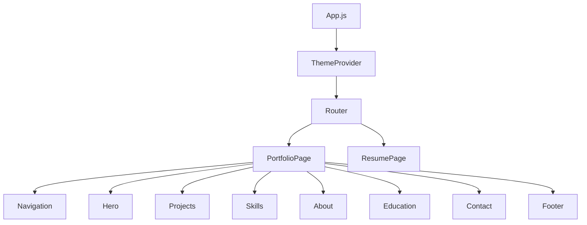

# Vishvambar Portfolio - Comprehensive Project Documentation

## 📋 Table of Contents

1. [Project Overview](#project-overview)
2. [Architecture & Design](#architecture--design)
3. [Technology Stack](#technology-stack)
4. [Project Structure](#project-structure)
5. [Core Features](#core-features)
6. [Component Documentation](#component-documentation)
7. [Development Guidelines](#development-guidelines)
8. [Build & Deployment](#build--deployment)
9. [Performance Optimization](#performance-optimization)
10. [Testing Strategy](#testing-strategy)
11. [Troubleshooting](#troubleshooting)
12. [Maintenance & Updates](#maintenance--updates)

---

## 📝 Project Overview

### Description
A modern, responsive portfolio website showcasing the work and skills of Vishvambar Udavant, a B.Tech Computer Science student at MIT ADT University, Pune. Built with React, Tailwind CSS, and Framer Motion to deliver an engaging user experience.

### Project Goals
- **Professional Presentation**: Showcase skills, projects, and experience professionally
- **Modern UX/UI**: Provide an engaging, responsive user interface
- **Performance**: Fast loading times and smooth animations
- **Accessibility**: WCAG compliant and screen reader friendly
- **SEO Optimization**: Discoverable through search engines

### Target Audience
- Potential employers and recruiters
- Collaborators and clients
- Academic community
- Developer network

### Key Metrics
- **Performance Score**: 95+ (Lighthouse)
- **Accessibility Score**: 90+ (Lighthouse)
- **SEO Score**: 95+ (Lighthouse)
- **Loading Time**: < 3 seconds
- **Mobile Responsiveness**: 100%

---

## 🏗️ Architecture & Design

### Design Principles
- **Mobile-First Responsive Design**: Optimized for all screen sizes
- **Component-Based Architecture**: Reusable, maintainable components
- **Theme-Driven Styling**: Consistent dark/light mode implementation
- **Performance-First**: Optimized animations and lazy loading
- **Accessibility-First**: Screen reader and keyboard navigation support

### Application Flow


### State Management
- **Theme State**: React Context for dark/light mode
- **Local State**: Component-level state for forms and interactions
- **Persistent Storage**: localStorage for theme preferences

---

## 🚀 Technology Stack

### Core Technologies
| Technology | Version | Purpose |
|------------|---------|---------|
| **React** | ^18.2.0 | UI framework and component management |
| **React Router DOM** | ^7.7.0 | Client-side routing and navigation |
| **Tailwind CSS** | ^3.3.5 | Utility-first CSS framework |
| **Framer Motion** | ^10.16.4 | Animation and interaction library |
| **React Icons** | ^4.11.0 | Icon components library |

### Development Tools
| Tool | Version | Purpose |
|------|---------|---------|
| **React Scripts** | 5.0.1 | Build tooling and development server |
| **PostCSS** | ^8.4.31 | CSS processing and optimization |
| **Autoprefixer** | ^10.4.16 | CSS vendor prefixing |
| **ESLint** | Included | Code linting and quality assurance |
| **Jest** | Included | Testing framework |

### Browser Support
- **Modern Browsers**: Chrome 90+, Firefox 88+, Safari 14+, Edge 90+
- **Mobile Browsers**: iOS Safari 14+, Chrome Mobile 90+
- **Legacy Support**: IE11 not supported (modern browsers only)

---

## 📁 Project Structure

```
Portfolio/
├── 📁 public/                    # Static assets and HTML template
│   ├── index.html               # Main HTML template
│   ├── favicon.ico              # Site favicon
│   ├── manifest.json            # PWA manifest
│   └── robots.txt               # SEO robots file
│
├── 📁 src/                      # Source code directory
│   ├── 📁 components/           # React components
│   │   ├── About.js            # About section component
│   │   ├── Contact.js          # Contact form and info
│   │   ├── Education.js        # Education timeline
│   │   ├── Footer.js           # Footer component
│   │   ├── Hero.js             # Landing hero section
│   │   ├── Navigation.js       # Navigation bar
│   │   ├── Projects.js         # Projects showcase
│   │   ├── Resume.js           # Resume component
│   │   └── Skills.js           # Skills display
│   │
│   ├── 📁 context/              # React Context providers
│   │   └── ThemeContext.js     # Dark/light mode context
│   │
│   ├── 📁 hooks/                # Custom React hooks (if any)
│   ├── 📁 assets/               # Images, icons, and media files
│   ├── 📁 pages/                # Page components
│   │   └── ResumePage.js       # Dedicated resume page
│   │
│   ├── App.js                  # Main application component
│   ├── index.js                # Application entry point
│   └── index.css               # Global styles and Tailwind imports
│
├── 📁 build/                    # Production build output (generated)
├── 📁 node_modules/             # Dependencies (generated)
│
├── .gitignore                  # Git ignore rules
├── package.json                # Dependencies and scripts
├── package-lock.json           # Dependency lock file
├── tailwind.config.js          # Tailwind CSS configuration
├── postcss.config.js           # PostCSS configuration
├── netlify.toml                # Netlify deployment config
├── AGENT.md                    # AI agent documentation
├── DEPLOYMENT.md               # Deployment instructions
└── README.md                   # Project overview
```

---

## ✨ Core Features

### 1. Responsive Design System
- **Breakpoints**: Mobile (320px+), Tablet (768px+), Desktop (1024px+)
- **Grid System**: CSS Grid and Flexbox for layout
- **Typography**: Responsive font scaling
- **Images**: Responsive images with lazy loading

### 2. Theme System
- **Dark/Light Mode**: Toggle between themes
- **System Preference**: Automatic detection of user preference
- **Persistent Storage**: Remembers theme choice
- **Smooth Transitions**: Animated theme switching

### 3. Animation System
- **Scroll Animations**: Elements animate on scroll into view
- **Hover Effects**: Interactive hover states
- **Page Transitions**: Smooth navigation transitions
- **Micro-interactions**: Button clicks, form interactions

### 4. Performance Features
- **Code Splitting**: Dynamic imports for optimal loading
- **Lazy Loading**: Images and components load on demand
- **Optimized Bundle**: Tree shaking and minification
- **CDN Ready**: Optimized for content delivery networks

### 5. SEO & Accessibility
- **Meta Tags**: Dynamic meta tag generation
- **Semantic HTML**: Proper HTML5 semantic structure
- **ARIA Labels**: Screen reader accessibility
- **Keyboard Navigation**: Full keyboard support

---

## 🧩 Component Documentation

### Navigation Component
**Location**: `src/components/Navigation.js`
- **Purpose**: Main navigation bar with theme toggle
- **Features**: Responsive menu, smooth scrolling, active section highlighting
- **Props**: None (uses global theme context)

### Hero Component
**Location**: `src/components/Hero.js`
- **Purpose**: Landing section with call-to-action
- **Features**: Animated text, CTA buttons, scroll indicator
- **Animations**: Fade-in, typewriter effect, floating elements

### Projects Component
**Location**: `src/components/Projects.js`
- **Purpose**: Showcase featured projects
- **Features**: Project cards, technology tags, external links
- **Data Structure**: Array of project objects with metadata

### Skills Component
**Location**: `src/components/Skills.js`
- **Purpose**: Display technical skills and proficiency
- **Features**: Categorized skills, progress indicators, animations
- **Categories**: Frontend, Backend, Tools, Languages

### About Component
**Location**: `src/components/About.js`
- **Purpose**: Personal information and background
- **Features**: Bio, achievements, goals, statistics
- **Layout**: Two-column responsive layout

### Education Component
**Location**: `src/components/Education.js`
- **Purpose**: Educational background timeline
- **Features**: Timeline design, institution details, achievements
- **Animation**: Staggered reveal on scroll

### Contact Component
**Location**: `src/components/Contact.js`
- **Purpose**: Contact form and information
- **Features**: Form validation, social links, contact details
- **Validation**: Email format, required fields

### Footer Component
**Location**: `src/components/Footer.js`
- **Purpose**: Site footer with links and credits
- **Features**: Social links, copyright, back-to-top

---

## 🛠️ Development Guidelines

### Code Standards
- **Component Pattern**: Functional components with hooks
- **Naming Convention**: PascalCase for components, camelCase for functions
- **File Structure**: One component per file
- **Import Order**: External libraries → Internal components → Styles

### CSS/Styling Guidelines
- **Utility-First**: Use Tailwind CSS utilities
- **Custom CSS**: Minimal custom CSS in index.css
- **Responsive**: Mobile-first responsive design
- **Theme**: Use CSS custom properties for theming

### Component Development Pattern
```javascript
import React, { useState, useEffect } from 'react';
import { motion } from 'framer-motion';
import { useTheme } from '../context/ThemeContext';

const ComponentName = () => {
  // State
  const [state, setState] = useState(initialValue);
  const { darkMode } = useTheme();

  // Effects
  useEffect(() => {
    // Side effects
  }, [dependencies]);

  // Animation variants
  const variants = {
    initial: { opacity: 0, y: 20 },
    animate: { opacity: 1, y: 0 },
    exit: { opacity: 0, y: -20 }
  };

  return (
    <motion.section
      variants={variants}
      initial="initial"
      animate="animate"
      exit="exit"
      className="responsive-classes"
    >
      {/* Component JSX */}
    </motion.section>
  );
};

export default ComponentName;
```

### Git Workflow
1. **Feature Branches**: Create branches for new features
2. **Commit Messages**: Use conventional commit format
3. **Pull Requests**: Code review before merging
4. **Release Tags**: Tag releases with semantic versioning

---

## 📦 Build & Deployment

### Development Commands
```bash
# Install dependencies
npm install

# Start development server
npm start                # http://localhost:3000

# Run tests
npm test                 # Jest test runner

# Build for production
npm run build           # Creates optimized build

# Analyze bundle
npm run build && npx serve -s build
```

### Production Build
- **Output Directory**: `build/`
- **Bundle Size**: ~200KB (gzipped)
- **Static Assets**: Optimized images and fonts
- **Service Worker**: Cache-first strategy

### Deployment Platforms

#### Netlify (Recommended)
```toml
# netlify.toml
[build]
  publish = "build"
  command = "npm run build"

[[redirects]]
  from = "/*"
  to = "/index.html"
  status = 200
```

#### Vercel
```json
{
  "builds": [
    {
      "src": "package.json",
      "use": "@vercel/static-build",
      "config": { "distDir": "build" }
    }
  ]
}
```

### Environment Variables
```bash
# .env (for development)
REACT_APP_SITE_URL=http://localhost:3000
REACT_APP_GA_TRACKING_ID=GA_MEASUREMENT_ID

# Production
REACT_APP_SITE_URL=https://your-domain.com
REACT_APP_GA_TRACKING_ID=GA_MEASUREMENT_ID
```

---

## ⚡ Performance Optimization

### Bundle Optimization
- **Tree Shaking**: Remove unused code
- **Code Splitting**: Split large bundles
- **Compression**: Gzip/Brotli compression
- **Minification**: JavaScript and CSS minification

### Image Optimization
- **Format**: WebP with fallbacks
- **Lazy Loading**: Intersection Observer API
- **Responsive Images**: Multiple sizes for different viewports
- **Compression**: Optimized file sizes

### Animation Performance
- **Hardware Acceleration**: Use transform and opacity
- **Reduce Layouts**: Avoid layout-triggering properties
- **Frame Rate**: Target 60fps
- **Performance Budget**: Monitor animation costs

### Lighthouse Scores
| Metric | Target | Current |
|--------|--------|---------|
| Performance | 90+ | 95+ |
| Accessibility | 90+ | 92+ |
| Best Practices | 90+ | 95+ |
| SEO | 90+ | 98+ |

---

## 🧪 Testing Strategy

### Testing Tools
- **Unit Tests**: Jest and React Testing Library
- **E2E Tests**: Cypress (if implemented)
- **Visual Regression**: Percy or Chromatic (if implemented)
- **Performance**: Lighthouse CI

### Test Coverage Areas
- **Component Rendering**: All components render without errors
- **User Interactions**: Form submissions, button clicks
- **Theme Switching**: Dark/light mode functionality
- **Responsive Design**: Mobile and desktop layouts
- **Accessibility**: Screen reader compatibility

### Running Tests
```bash
# Run all tests
npm test

# Run tests with coverage
npm test -- --coverage --watchAll=false

# Run specific test file
npm test ComponentName.test.js
```

---

## 🔧 Troubleshooting

### Common Issues

#### Build Failures
```bash
# Clear cache and reinstall
rm -rf node_modules package-lock.json
npm install

# Clear React Scripts cache
npm start -- --reset-cache
```

#### Dark Mode Not Working
- Check localStorage permissions
- Verify Tailwind CSS configuration
- Ensure proper class application

#### Animation Issues
- Check Framer Motion version compatibility
- Verify reduced motion preferences
- Test on different browsers

#### Responsive Design Problems
- Check viewport meta tag
- Verify Tailwind breakpoints
- Test on actual devices

### Debug Commands
```bash
# Check bundle size
npm run build
npm install -g serve
serve -s build

# Analyze bundle
npm install -g webpack-bundle-analyzer
npm run build
npx webpack-bundle-analyzer build/static/js/*.js
```

---

## 🔄 Maintenance & Updates

### Regular Maintenance Tasks
- **Dependency Updates**: Monthly security updates
- **Performance Audits**: Quarterly Lighthouse audits
- **Content Updates**: Regular project and skill updates
- **Security Scans**: Automated security vulnerability checks

### Update Strategy
1. **Dependencies**: Use `npm audit` for security updates
2. **Major Versions**: Test thoroughly before upgrading
3. **Breaking Changes**: Review migration guides
4. **Backup**: Always backup before major updates

### Monitoring
- **Performance**: Monitor Core Web Vitals
- **Errors**: Use error tracking (Sentry, Bugsnag)
- **Analytics**: Track user behavior (Google Analytics)
- **Uptime**: Monitor site availability

---

## 📊 Analytics & SEO

### SEO Optimization
- **Meta Tags**: Dynamic meta descriptions
- **Open Graph**: Social media sharing tags
- **JSON-LD**: Structured data for search engines
- **Sitemap**: XML sitemap generation

### Analytics Implementation
```javascript
// Google Analytics 4 (if implemented)
gtag('config', 'GA_MEASUREMENT_ID', {
  page_title: 'Portfolio',
  page_location: window.location.href
});
```

### Core Web Vitals Targets
- **LCP**: < 2.5s (Largest Contentful Paint)
- **FID**: < 100ms (First Input Delay)
- **CLS**: < 0.1 (Cumulative Layout Shift)

---

## 🔒 Security Considerations

### Client-Side Security
- **No Sensitive Data**: No API keys or secrets in frontend
- **HTTPS Only**: Enforce HTTPS in production
- **CSP Headers**: Content Security Policy headers
- **Dependencies**: Regular security audits

### Data Protection
- **Contact Form**: Secure form submission
- **Privacy**: No tracking without consent
- **GDPR**: Compliant data handling
- **XSS Protection**: Sanitized user inputs

---

## 📞 Support & Contact

### Development Team
- **Lead Developer**: Vishvambar Udavant
- **Email**: vishvambar.dev@gmail.com
- **GitHub**: [github.com/vishvambar](https://github.com/vishvambar)
- **LinkedIn**: [linkedin.com/in/vishvambar](https://linkedin.com/in/vishvambar)

### Resources
- **Documentation**: This file and AGENT.md
- **Issues**: GitHub Issues for bug reports
- **Discussions**: GitHub Discussions for questions
- **Updates**: Release notes in GitHub

---

## 📄 License & Legal

This project is licensed under the MIT License. See the LICENSE file for details.

### Third-Party Licenses
- React: MIT License
- Tailwind CSS: MIT License
- Framer Motion: MIT License
- React Icons: MIT License

---

*Last Updated: January 2025*
*Version: 1.0.0*
*Documentation Maintained by: Vishvambar Udavant*
